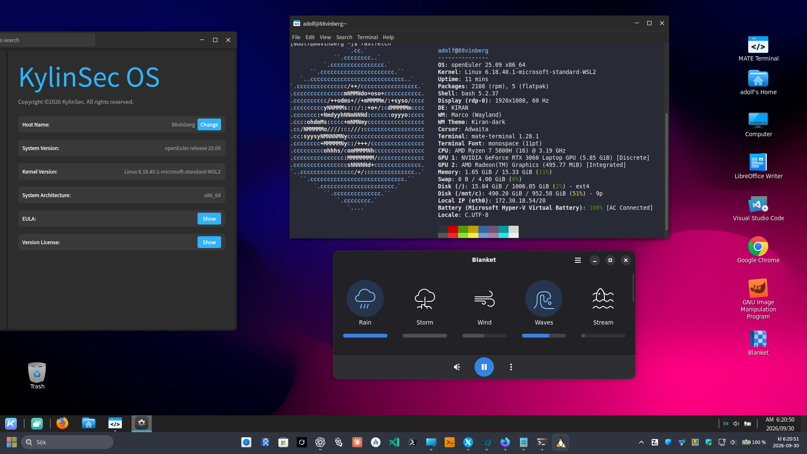

# WSL - openEuler Desktop Collection.


A community collection for running complete openEuler desktop environments in WSL 2 on Windows.

The first tested desktop is **Kiran Desktop on openEuler 25.09 through X410**. The repository is structured so UKUI, GNOME, KDE Plasma, XFCE, Deepin and other desktops can be added without mixing their launchers, settings or diagnostics.

> This is a personal/community project. It is not an official openEuler, KylinSec, Microsoft or X410 project.

# WSL - openEuler via Kiran Desktop - 2026



## Installation walkthrough and video

- [Complete Kiran installation walkthrough](OpenEuler25.09-KIRAN.txt)
- **YouTube video guide:** [How to install KIRAN via openEuler](https://www.youtube.com/watch?v=2XqTazXq5JY)

The supported quick installer below is the shortest route. The longer walkthrough also covers the openEuler setup, optional desktop applications and the final X410 startup steps.

## Quick install: Kiran + X410

Run this inside the openEuler WSL distribution as your normal Linux user, not as root:

```bash
wget https://raw.githubusercontent.com/vinberg88/openEuler/main/install.sh
less install.sh
bash install.sh kiran
```

The installer downloads the Kiran launcher files, installs the complete openEuler `kiran-desktop` package when needed, validates the environment, installs the Linux service and creates a **Kiran Desktop (X410)** shortcut on the Windows desktop.

Every downloaded launcher file is checked against a SHA-256 digest embedded in the reviewed installer before it can be executed or installed.

Keep download and execution as separate steps. Do not pipe a remote installer directly into a shell; downloading it first makes the exact code being granted installation privileges visible and reviewable.

## Requirements

- Windows 11 with WSL 2
- openEuler 25.09
- systemd enabled in `/etc/wsl.conf`
- openEuler repositories providing the `kiran-desktop` package
- X410 installed on Windows and available through its app execution alias
- `sudo`, `wget` or `curl`

## Commands after installation

```bash
kiran-x410 start
kiran-x410 stop
kiran-x410 restart
kiran-x410 status
kiran-x410 doctor
kiran-x410 log
```

## Normal start

1. Double-click **Kiran Desktop (X410)** on the Windows desktop.
2. Wait a few seconds while the shortcut starts X410 in Desktop mode and launches the managed Kiran session.
3. Leave X410 running quietly in the Windows background or system tray for the entire Kiran session.

X410 is the display server behind the desktop. It should not need a separate visible control window, but it must remain running while Kiran is in use. Do not start `kiran-session-manager` manually alongside the shortcut, because that can create duplicate panels and unpredictable sessions.

## Uninstall the integration

Download and inspect the uninstaller, then run it as the same normal Linux user:

```bash
wget https://raw.githubusercontent.com/vinberg88/openEuler/main/uninstall.sh
less uninstall.sh
bash uninstall.sh kiran
```

This removes the launcher, user service and Windows shortcut. It deliberately keeps the openEuler `kiran-desktop` packages, personal files and session logs.

## Desktop collection

| Desktop | openEuler version | Display path | Status |
|---|---:|---|---|
| Kiran Desktop | 25.09 | X410 / X11 | ✅ Tested |
| UKUI | To be selected | X410 / X11 | 🧪 Planned |
| GNOME | To be selected | WSLg or X410 | 🧪 Planned |
| KDE Plasma | To be selected | X410 / X11 | 🧪 Planned |
| XFCE | To be selected | X410 / X11 | 🧪 Planned |
| Deepin Desktop | To be selected | X410 / X11 | 🧪 Planned |
| Cinnamon | To be selected | X410 / X11 | 🧪 Planned |
| MATE | To be selected | X410 / X11 | 🧪 Planned |
| LXQt | To be selected | X410 / X11 | 🧪 Planned |

See [DESKTOPS.md](DESKTOPS.md) for the test standard and roadmap.

## What the Kiran installer fixes

- always runs Kiran as the selected non-root Linux user;
- discovers the Windows host address instead of reusing WSLg's `DISPLAY`;
- starts one controlled X11 session with Marco, Kiran Panel and Caja;
- keeps WSL alive through a hidden Windows-side holder process;
- preserves WSLg audio when its Pulse server is available;
- prevents duplicate session launches with a runtime lock;
- disables WSL-inappropriate network, printer, SELinux and lock-screen applets for the current user;
- writes a readable session log under `~/.local/state/kiran-x410/`.

## Repository layout

```text
.
├── LICENSE
├── OpenEuler25.09-KIRAN.txt
├── install.sh
├── uninstall.sh
├── DESKTOPS.md
├── desktops/
│   └── kiran/
│       ├── README.md
│       └── files/
└── images/
```

Each future desktop receives its own installer assets and documentation under `desktops/<name>/`.

## Troubleshooting

### `powershell.exe: Permission denied`

If the installer reaches the Windows shortcut step and reports that `powershell.exe` is not permitted, check `/etc/wsl.conf`. An automount option such as `fmask=11` removes the execute bit from Windows programs for normal Linux users. Change that option to:

```ini
[automount]
enabled=true
root=/mnt/
options="metadata,umask=22,fmask=022"
```

Then close WSL and run this from **Windows PowerShell**:

```powershell
wsl --shutdown
```

Start openEuler again and rerun `bash install.sh kiran`. The installer is repeatable, so the partially completed first run does not need to be removed.

Run:

```bash
kiran-x410 doctor
kiran-x410 log 200
```

Do not start `kiran-session-manager`, `kiran-panel` or the desktop with `sudo`. Mixing root sessions, WSLg's display and X410 is the main cause of duplicated panels and unpredictable startup.

## License

The launcher, installer and repository documentation are available under the [MIT License](LICENSE). Third-party projects and packages retain their own licenses.
