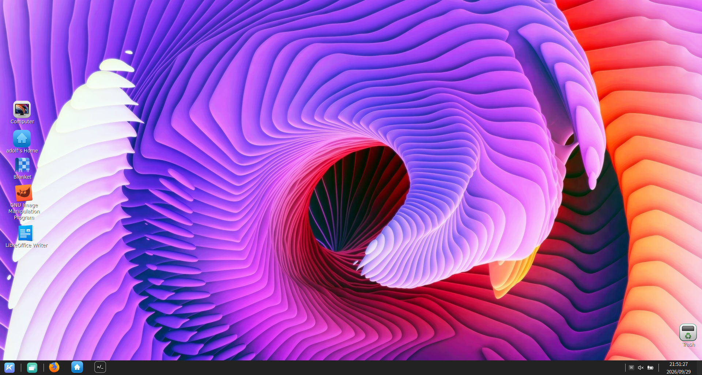

# openEuler Desktop Collection for WSL


A community collection for running complete openEuler desktop environments in WSL 2 on Windows.

The first tested desktop is **Kiran Desktop on openEuler 25.09 through X410**. The repository is structured so UKUI, GNOME, KDE Plasma, XFCE, Deepin and other desktops can be added without mixing their launchers, settings or diagnostics.

> This is a personal/community project. It is not an official openEuler, KylinSec, Microsoft or X410 project.



## Quick install: Kiran + X410

Run this inside the openEuler WSL distribution as your normal Linux user, not as root:

```bash
wget https://raw.githubusercontent.com/vinberg88/openEuler/main/install.sh
less install.sh
bash install.sh kiran
```

The installer downloads the Kiran launcher files, installs the complete openEuler `kiran-desktop` package when needed, validates the environment, installs the Linux service and creates a **Kiran Desktop (X410)** shortcut on the Windows desktop.

For a compact one-liner after inspecting the repository:

```bash
wget -qO- https://raw.githubusercontent.com/vinberg88/openEuler/main/install.sh | bash -s -- kiran
```

## Requirements

- Windows 11 with WSL 2
- openEuler 25.09
- systemd enabled in `/etc/wsl.conf`
- openEuler repositories providing the `kiran-desktop` package
- X410 installed on Windows and available through its app execution alias
- `sudo`, `wget` or `curl`

## Commands after installation

```bash
kiran-x410 start
kiran-x410 stop
kiran-x410 restart
kiran-x410 status
kiran-x410 doctor
kiran-x410 log
```

For normal use, launch **Kiran Desktop (X410)** from the Windows desktop. The shortcut starts X410 in Desktop mode and keeps the WSL session alive for as long as Kiran is running.

## Desktop collection

| Desktop | openEuler version | Display path | Status |
|---|---:|---|---|
| Kiran Desktop | 25.09 | X410 / X11 | ✅ Tested |
| UKUI | To be selected | X410 / X11 | 🧪 Planned |
| GNOME | To be selected | WSLg or X410 | 🧪 Planned |
| KDE Plasma | To be selected | X410 / X11 | 🧪 Planned |
| XFCE | To be selected | X410 / X11 | 🧪 Planned |
| Deepin Desktop | To be selected | X410 / X11 | 🧪 Planned |
| Cinnamon | To be selected | X410 / X11 | 🧪 Planned |
| MATE | To be selected | X410 / X11 | 🧪 Planned |
| LXQt | To be selected | X410 / X11 | 🧪 Planned |

See [DESKTOPS.md](DESKTOPS.md) for the test standard and roadmap.

## What the Kiran installer fixes

- always runs Kiran as the selected non-root Linux user;
- discovers the Windows host address instead of reusing WSLg's `DISPLAY`;
- starts one controlled X11 session with Marco, Kiran Panel and Caja;
- keeps WSL alive through a hidden Windows-side holder process;
- preserves WSLg audio when its Pulse server is available;
- prevents duplicate session launches with a runtime lock;
- disables WSL-inappropriate network, printer, SELinux and lock-screen applets for the current user;
- writes a readable session log under `~/.local/state/kiran-x410/`.

## Repository layout

```text
.
├── install.sh
├── DESKTOPS.md
├── desktops/
│   └── kiran/
│       ├── README.md
│       └── files/
└── images/
```

Each future desktop receives its own installer assets and documentation under `desktops/<name>/`.

## Troubleshooting

Run:

```bash
kiran-x410 doctor
kiran-x410 log 200
```

Do not start `kiran-session-manager`, `kiran-panel` or the desktop with `sudo`. Mixing root sessions, WSLg's display and X410 is the main cause of duplicated panels and unpredictable startup.
